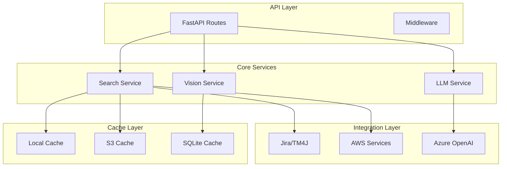

```mermaid
graph TD
    subgraph API Layer
        A[FastAPI Routes]
        B[Middleware]
    end
    
    subgraph Core Services
        C[Search Service]
        D[Vision Service]
        E[LLM Service]
    end
    
    subgraph Integration Layer
        F[Jira/TM4J]
        G[AWS Services]
        H[Azure OpenAI]
    end
    
    subgraph Cache Layer
        I[Local Cache]
        J[S3 Cache]
        K[SQLite Cache]
    end
    
    A --> C
    A --> D
    A --> E
    C --> F
    C --> G
    E --> H
    C --> I
    C --> J
    D --> K
```
